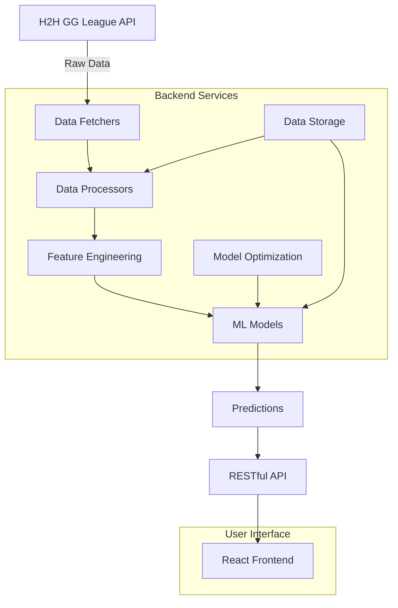

# Project Overview

## What is 2K Spark?

2K Spark (also known as "2K Flash") is a comprehensive prediction system for NBA 2K25 eSports matches in the H2H GG League. The system combines real-time data collection, advanced machine learning, and modern web technologies to provide accurate match predictions and player statistics.

## Key Features

### 🎯 **Intelligent Predictions**
- **Winner Prediction**: Advanced classification models predict match outcomes
- **Score Prediction**: Regression models forecast exact game scores
- **Real-time Updates**: Continuous data refresh for current predictions

### 📊 **Advanced Analytics**
- **Player Statistics**: Comprehensive performance metrics and trends
- **Feature Engineering**: Advanced statistical transformations
- **Cross-validation**: Robust model validation techniques

### 🔬 **Machine Learning Excellence**
- **Ensemble Methods**: Multiple algorithms for improved accuracy
- **Bayesian Optimization**: Automated hyperparameter tuning
- **Model Registry**: Versioned model management system

### 🌐 **Modern Web Interface**
- **React Frontend**: Built with Next.js and TypeScript
- **Responsive Design**: Works on desktop and mobile devices
- **Dark Mode**: Modern UI with theme support

## System Architecture

## Technology Stack

### **Backend**
- **Language**: Python 3.10+
- **Framework**: Flask with CORS support
- **ML Libraries**: scikit-learn, pandas, numpy
- **Optimization**: scikit-optimize for Bayesian optimization
- **Data Collection**: Selenium for web scraping

### **Frontend**
- **Framework**: Next.js 13+ with App Router
- **Language**: TypeScript
- **Styling**: Tailwind CSS + Shadcn UI
- **Charts**: Chart.js with react-chartjs-2
- **Icons**: Lucide React

### **Infrastructure**
- **Deployment**: Vercel (frontend) + Render (backend)
- **CI/CD**: GitHub Actions
- **Storage**: File-based JSON (migrating to database)
- **Monitoring**: Comprehensive logging system

## Data Flow

### 1. **Data Collection**
- Fetch authentication tokens from H2H GG League
- Retrieve historical match data
- Collect upcoming match schedules
- Gather player statistics

### 2. **Data Processing**
- Clean and validate incoming data
- Calculate advanced player metrics
- Generate feature engineered variables
- Store processed data for model training

### 3. **Model Training**
- Train winner prediction models (classification)
- Train score prediction models (regression)
- Optimize hyperparameters using Bayesian optimization
- Validate models using cross-validation

### 4. **Prediction Generation**
- Generate predictions for upcoming matches
- Calculate confidence scores
- Store predictions with metadata
- Update prediction history

### 5. **API & Frontend**
- Serve predictions via RESTful API
- Display results in responsive web interface
- Provide real-time updates and statistics
- Enable data refresh and system monitoring

## Project Goals

### **Primary Objectives**
1. **Accuracy**: Achieve high prediction accuracy for eSports matches
2. **Real-time**: Provide up-to-date predictions and statistics
3. **Scalability**: Build a system that can handle growth
4. **Usability**: Create an intuitive user interface

### **Secondary Objectives**
1. **Performance**: Fast response times and efficient processing
2. **Reliability**: Robust error handling and system stability
3. **Maintainability**: Clean, documented, and testable code
4. **Extensibility**: Easy to add new features and data sources

## Current Status

### ✅ **Completed**
- Complete backend architecture and API
- Advanced machine learning models with optimization
- React frontend with responsive design
- Data pipeline with real H2H GG League integration
- Comprehensive logging and monitoring

### 🚧 **In Progress**
- Testing infrastructure implementation
- UI/UX improvements and polish
- Performance optimization
- Documentation completion

### 📋 **Planned**
- Database migration from file-based storage
- Enhanced security and authentication
- Advanced data visualizations
- Mobile app development

## Getting Started

For developers looking to get started with the project:

1. **Setup**: Follow the [Development Environment Setup](../development/environment-setup.md)
2. **Architecture**: Review the [Technical Architecture](./tech-stack.md)
3. **API**: Explore the [API Documentation](../development/api-docs.md)
4. **Frontend**: Check the [Frontend Components](../components/frontend/)

---

**Last Updated**: June 17, 2025
